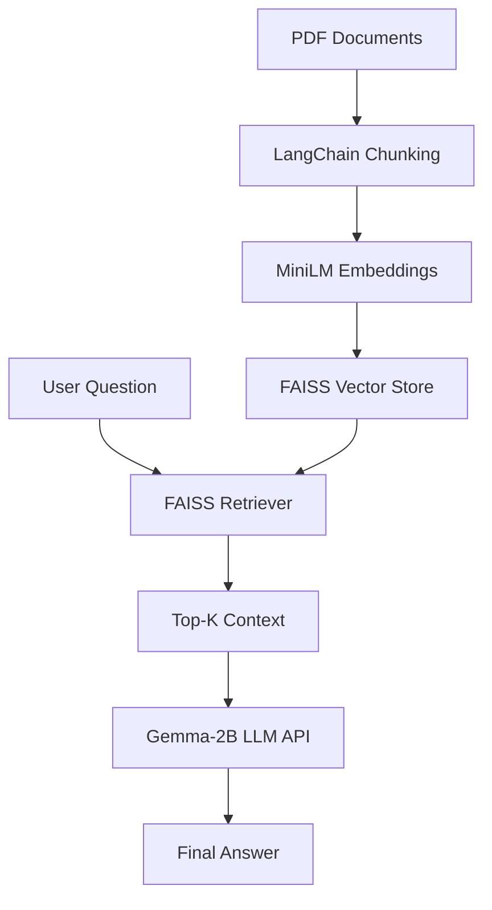

# 🤖 Private LLM-Powered Document QA System

A high-performance, retrieval-augmented LLM application built using **LangChain**, **FAISS**, and **Google's Gemma-2B** model via Hugging Face Inference API.

This system enables intelligent, context-aware question answering over **pre-indexed documents** (PDFs) — without exposing document uploads to end users. Designed for private, secure, and performant document intelligence applications.

---

## 💡 Key Features

| Capability                             | Description                                                                 |
|----------------------------------------|-----------------------------------------------------------------------------|
| 🧠 **LLM-Driven QA**                    | Uses `google/gemma-2b-it` for response generation                          |
| 🔍 **RAG Pipeline**                    | Retrieval-Augmented Generation with semantic search over vector DB         |
| 🧩 **Chunk-Aware Indexing**             | Text is split into optimized chunks for embedding                          |
| 🧬 **Vector Embeddings**                | Encodes text with `MiniLM` (sentence-transformers)                         |
| ⚡ **FAISS**                            | Fast and scalable vector similarity search                                 |
| 🧱 **LangChain**                        | Powers document loaders, chunking, embedding & retrieval chain             |
| 🛡️ **Admin-Controlled Document Access** | Only backend PDFs are queried — users cannot upload or modify documents    |
| 🖥️ **MacBook Air Optimized**            | Entirely API-based — no GPU needed, light CPU usage                        |

---

## 🧠 System Architecture



---

## ⚙️ Technology Stack

- `LangChain`: modular pipeline for document Q&A
- `FAISS`: efficient vector search
- `sentence-transformers/all-MiniLM-L6-v2`: compact, performant embedding model
- `Hugging Face InferenceClient`: connects to `google/gemma-2b-it`
- `Streamlit`: UI for question submission and response display
- `pickle`: persistent vector index caching

---

## 🧪 How It Works

1. **Admin loads PDF(s)** (e.g. a resume or private document)
2. LangChain splits text into **semantic chunks**
3. Each chunk is embedded via **MiniLM**
4. FAISS indexes the embeddings
5. At runtime:
   - A user question is vector-matched with the closest text chunks
   - The top-k chunks are passed as context to **Gemma-2B**
   - The LLM generates a natural language answer based on private context

---

## 🔐 Use Cases

- Resume or profile Q&A assistant
- Secure document intelligence systems (e.g. policy, contract, research docs)
- Internal knowledge base automation
- Educational Q&A interfaces

---

## 🛠️ How to Use

### 1. Clone the Repository
```bash
git clone https://github.com/your-org/private-llm-docqa.git
cd private-llm-docqa
```

### 2. Install Dependencies
```bash
pip install -r requirements.txt
```

### 3. Place Your PDFs
Put your private documents in the `docs/` folder, e.g.:
```
docs/Aditya_Suyal_Resume.pdf
```

### 4. Run Vectorization Script (Admin Only)
```bash
python admin_vectorize.py
```

This will generate `vectorstore_index.pkl`.

### 5. Launch Streamlit App
```bash
streamlit run app.py
```

---

## 📂 Project Structure

```
├── docs/
│   └── Aditya_Suyal_Resume.pdf
├── admin_vectorize.py      # Embedding + vector index generator
├── app.py                  # Frontend Streamlit Q&A app
├── vectorstore_index.pkl   # Precomputed semantic index
├── README.md
└── requirements.txt
```

---

## 🤖 Example Questions You Can Ask

- "What programming languages does Aditya know?"
- "List the academic qualifications."
- "What achievements are mentioned in the resume?"
- "Summarize the document."

---

## 🧠 Why It’s an LLM Project

- ✅ Powered by a **state-of-the-art instruction-tuned LLM**
- ✅ Implements the **Retrieval-Augmented Generation (RAG)** pattern
- ✅ Combines **dense vector similarity search** with **semantic LLM reasoning**
- ✅ Uses **LangChain**, the standard framework for LLM orchestration
- ✅ Delivers intelligent responses based on **private, structured document knowledge**

---

## 📄 License

MIT License – open for research, commercial adaptation, and educational use.

---

> Built with ❤️ using open LLMs, FAISS, and LangChain. Optimized for lightweight deployment on everyday machines.